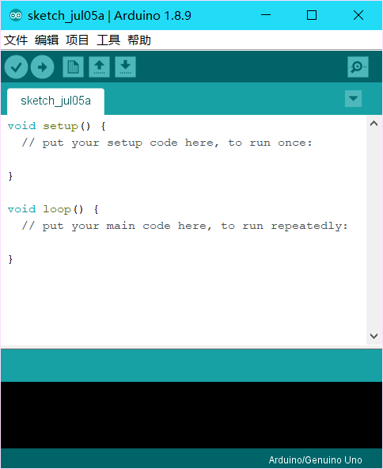
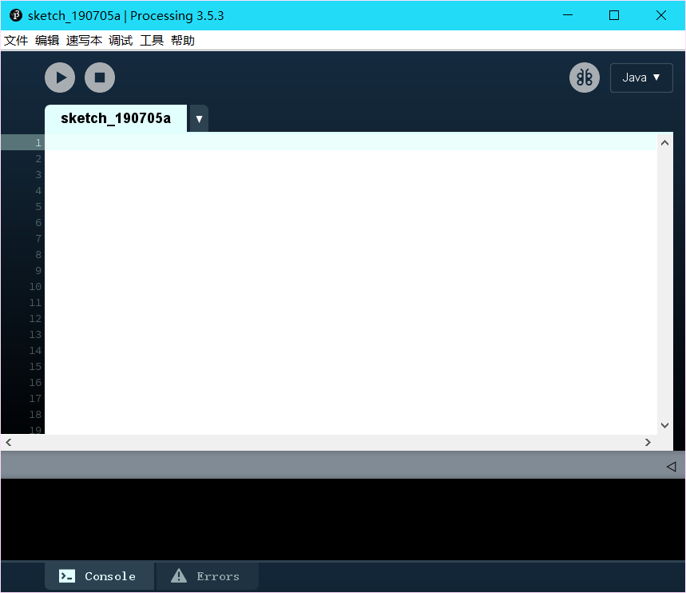
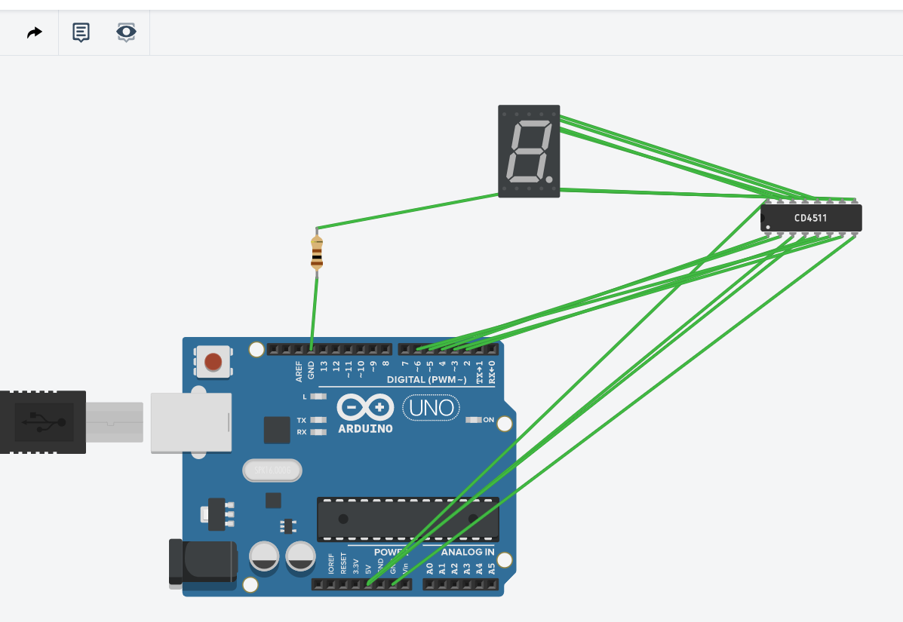
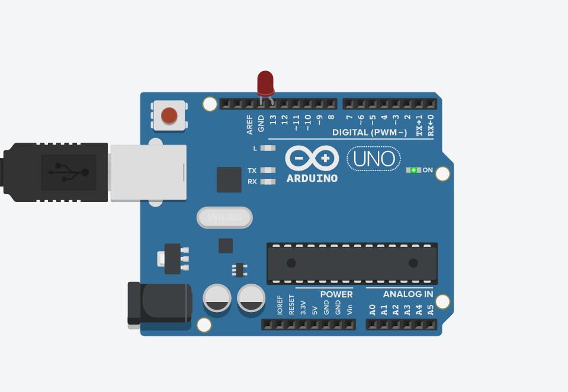

# 开源硬件设计

>李辙

## 第一天

#### 学习内容
    如何学习开源硬件    
    几个常用的网站  
    三个软件的安装

    arduino
  
    fritzing
  
    processing
  


## 第二天

    Morse.h
```c
    #ifndef _MORSE_H
    #define _MORSE_H
    class Morse
    {
    public:
        Morse(int pin);
        void dot();
        void dash();
        void c_space();
        void w_space();
        void s_space();
    private:
        int _pin;
        int _dottime;
    };
    #endif /*_MORSE_H*/
```
    Morse.cpp
```c
#include "Arduino.h"
#include "Morse.h"

Morse::Morse(int pin)
{
	pinMode(pin,OUTPUT);
	_pin=pin;
	_dottime=250;
}

void Morse::dot()
{
	digitalWrite(_pin,HIGH);
	delay(_dottime);
	digitalWrite(_pin,LOW);
	delay(_dottime);
}

void Morse::dash()
{
	digitalWrite(_pin,HIGH);
	delay(_dottime*4);
	digitalWrite(_pin,LOW);
	delay(_dottime);
}

void Morse::c_space()
{
	digitalWrite(_pin,LOW);
	delay(_dottime*3);
}

void Morse::w_space()
{
	digitalWrite(_pin,LOW);
	delay(_dottime*7);
}

void Morse::s_space()
{
	digitalWrite(_pin,LOW);
	delay(_dottime*4);
}

```

    Mrose.ino
```c
#include<Mrose.h>
Morse morse(13);

void setup() {
  Serial.begin(9600);
}

void loop() {
  if (Serial.available() > 0)//判断是否有输入
  {
    int i = Serial.read();//进行相应的莫尔斯电码输出
      switch (i)
      {
      case 32: morse.s_space();break;
      case 97: morse.dot();morse.dash();break;
      case 98: morse.dash();morse.dot();morse.dot();morse.dot();break;
      case 99: morse.dash();morse.dot();morse.dash();morse.dot();break;
      case 100: morse.dash();morse.dot();morse.dot();break;
      case 101: morse.dot();break;
      case 102: morse.dot();morse.dot();morse.dash();morse.dot();break;
      case 103: morse.dash();morse.dash();morse.dot();break;
      case 104: morse.dot();morse.dot();morse.dot();morse.dot();break;
      case 105: morse.dot();morse.dot();break;
      case 106: morse.dot();morse.dash();morse.dash();morse.dash();break;
      case 107: morse.dash();morse.dot();morse.dash();break;
      case 108: morse.dot();morse.dash();morse.dot();morse.dot();break;
      case 109: morse.dash();morse.dash();break;
      case 110: morse.dash();morse.dot();break;
      case 111: morse.dash();morse.dash();morse.dash();break;
      case 112: morse.dot();morse.dash();morse.dash();morse.dot();break;
      case 113: morse.dash();morse.dash();morse.dot();morse.dash();break;
      case 114: morse.dot();morse.dash();morse.dot();break;
      case 115: morse.dot();morse.dot();morse.dot();break;
      case 116: morse.dash();break;
      case 117: morse.dot();morse.dot();morse.dash();break;
      case 118: morse.dot();morse.dot();morse.dot();morse.dash();break;
      case 119: morse.dot();morse.dash();morse.dash();break;
      case 120: morse.dash();morse.dot();morse.dot();morse.dash();break;
      case 121: morse.dash();morse.dot();morse.dash();morse.dash();break;
      case 122: morse.dash();morse.dash();morse.dot();morse.dot();break;
      default: morse.s_space();break;
      }
      morse.c_space();
  }

}
```

## 第三天

    小车电路图

    
```c
void setup()
{
  pinMode(9, OUTPUT);
  pinMode(10, OUTPUT);
  pinMode(5, OUTPUT);
  pinMode(6, OUTPUT);
  Serial.begin(9600);
}
int income = 0;
void loop()
{
  if (Serial.available()>0)
  {
    income = Serial.read();
  }
  switch(income)
  {
    case 'f':
        forward();
        break;
    case 'b':
        backward();
        break;
    case 'l':
        left();
        break;
    case 'r':
        right();
        break;
    case 's':
        stop();
        break;
    default:
        break;
  }
  
}

void forward()
{
  digitalWrite(5, HIGH);
  digitalWrite(6, LOW);
  digitalWrite(9, HIGH);
  digitalWrite(10, LOW);
}

void backward()
{
  digitalWrite(6, HIGH);
  digitalWrite(5, LOW);
  digitalWrite(10, HIGH);
  digitalWrite(9, LOW);
}

void left()
{
  digitalWrite(5, HIGH);
  digitalWrite(6, LOW);
  digitalWrite(10, HIGH);
  digitalWrite(9, LOW);
}

void right()
{
  digitalWrite(6, HIGH);
  digitalWrite(5, LOW);
  digitalWrite(9, HIGH);
  digitalWrite(10, LOW);
}

void stop()
{
  digitalWrite(5, LOW);
  digitalWrite(6, LOW);
  digitalWrite(9, LOW);
  digitalWrite(10, LOW);
}
```

    数码管


    代码
```c
void setup()
{
  pinMode(0, OUTPUT);
  pinMode(1, OUTPUT);
  pinMode(2, OUTPUT);
  pinMode(3, OUTPUT);
  pinMode(4, OUTPUT);
  Serial.begin(9600);
}
byte income=0;
void loop()
{
  if(Serial.available()>0)
  {
    income = Serial.read();
    income = income - '0';
    digitalWrite(0,LOW);
    delay(10);
    if(income & 0x1)
    {
      digitalWrite(1,HIGH);
    }
    else
    {
      digitalWrite(1,LOW);
    }
    if((income>>1) & 0x1)
    {
      digitalWrite(2,HIGH);
    }
    else
    {
      digitalWrite(2,LOW);
    }
    if((income>>2) & 0x1)
    {
      digitalWrite(3,HIGH);
    }
    else
    {
      digitalWrite(3,LOW);
    }
    if((income>>3) & 0x1)
    {
      digitalWrite(4,HIGH);
    }
    else
    {
      digitalWrite(4,LOW);
    }
    delay(10);
    digitalWrite(0,HIGH);
    delay(10);
  }
}
```


## 第四天
    morse修改

```c
#ifndef _MORSE_H
#define _MORSE_H
class Morse
{
  public:
    Morse(int pin);
    void dot();
    void dash();
    void c_space();
    void w_space();
    void s_space();
  private:
    int _pin;
    int _dottime;
};
#endif /*_MORSE_H*/

Morse::Morse(int pin)
{
  pinMode(pin,OUTPUT);
  _pin=pin;
  _dottime=250;
}

void Morse::dot()
{
  digitalWrite(_pin,HIGH);
  delay(_dottime);
  digitalWrite(_pin,LOW);
  delay(_dottime);
}

void Morse::dash()
{
  digitalWrite(_pin,HIGH);
  delay(_dottime*4);
  digitalWrite(_pin,LOW);
  delay(_dottime);
}

void Morse::c_space()
{
  digitalWrite(_pin,LOW);
  delay(_dottime*3);
}

void Morse::w_space()
{
  digitalWrite(_pin,LOW);
  delay(_dottime*7);
}

void Morse::s_space()
{
  digitalWrite(_pin,LOW);
  delay(_dottime*4);
}
Morse morse(13);

void setup() {
  Serial.begin(9600);
}

void loop() {
  if (Serial.available() > 0)//判断是否有输入
  {
    int i = Serial.read();//进行相应的莫尔斯电码输出
      switch (i)
      {
      case 32: morse.s_space();break;
      case 97: morse.dot();morse.dash();break;
      case 98: morse.dash();morse.dot();morse.dot();morse.dot();break;
      case 99: morse.dash();morse.dot();morse.dash();morse.dot();break;
      case 100: morse.dash();morse.dot();morse.dot();break;
      case 101: morse.dot();break;
      case 102: morse.dot();morse.dot();morse.dash();morse.dot();break;
      case 103: morse.dash();morse.dash();morse.dot();break;
      case 104: morse.dot();morse.dot();morse.dot();morse.dot();break;
      case 105: morse.dot();morse.dot();break;
      case 106: morse.dot();morse.dash();morse.dash();morse.dash();break;
      case 107: morse.dash();morse.dot();morse.dash();break;
      case 108: morse.dot();morse.dash();morse.dot();morse.dot();break;
      case 109: morse.dash();morse.dash();break;
      case 110: morse.dash();morse.dot();break;
      case 111: morse.dash();morse.dash();morse.dash();break;
      case 112: morse.dot();morse.dash();morse.dash();morse.dot();break;
      case 113: morse.dash();morse.dash();morse.dot();morse.dash();break;
      case 114: morse.dot();morse.dash();morse.dot();break;
      case 115: morse.dot();morse.dot();morse.dot();break;
      case 116: morse.dash();break;
      case 117: morse.dot();morse.dot();morse.dash();break;
      case 118: morse.dot();morse.dot();morse.dot();morse.dash();break;
      case 119: morse.dot();morse.dash();morse.dash();break;
      case 120: morse.dash();morse.dot();morse.dot();morse.dash();break;
      case 121: morse.dash();morse.dot();morse.dash();morse.dash();break;
      case 122: morse.dash();morse.dash();morse.dot();morse.dot();break;
      default: morse.s_space();break;
      }
      morse.c_space();
  }

}
```
